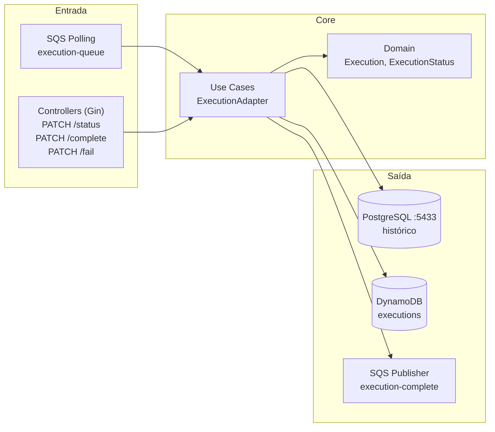
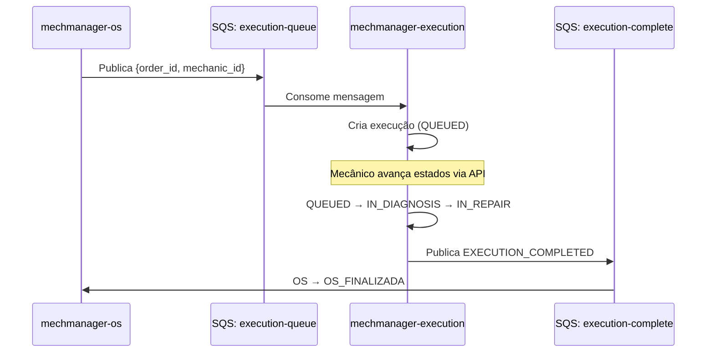
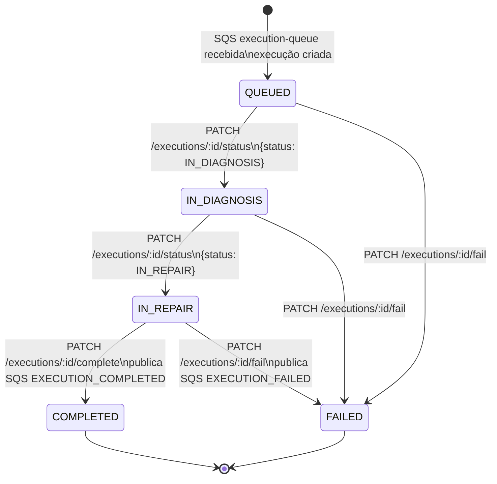

# mechmanager-execution

Microsserviço responsável pela fila de execução mecânica das Ordens de Serviço no ecossistema **MechManager**. Gerencia o ciclo de vida da execução — do diagnóstico à conclusão — e publica eventos de compensação via AWS SQS quando há falhas.

> FIAP POS TECH — Tech Challenge · Arquitetura de Microsserviços

---

## Responsabilidades

- Consumir a fila `execution-queue` (SQS) e criar execuções para cada OS aprovada
- Gerenciar estados progressivos da execução mecânica
- Persistir histórico completo no PostgreSQL
- Manter estado em tempo real no DynamoDB
- Publicar evento `EXECUTION_COMPLETED` ou `EXECUTION_FAILED` na fila `execution-complete`
- Acionar Saga Rollback em caso de falha (notifica OS Service para liberar peças)

---

## Arquitetura

### Hexagonal (Ports & Adapters)



### Posição na Saga



### Máquina de Estados



> **Importante:** Use sempre `PATCH /executions/:id/complete` para concluir uma execução.
> `PATCH /executions/:id/status` com `COMPLETED` apenas atualiza o banco, **sem publicar o evento SQS**.

---

## Stack

| Camada | Tecnologia |
|---|---|
| Linguagem | Go 1.22+ |
| Framework HTTP | Gin |
| ORM | GORM + go-gormigrate |
| Banco relacional | PostgreSQL 15 (histórico) |
| Banco chave-valor | AWS DynamoDB (estado em tempo real) |
| Mensageria | AWS SQS (LocalStack em dev) |
| Testes | testify + mock |
| Infra | Docker / Docker Compose |

---

## Estrutura de Diretórios

```
src/
├── cmd/api/              # Entrypoint — main.go
├── adapter/
│   ├── controllers/      # Handlers HTTP (Gin)
│   ├── service/          # Use Cases + SQS Publisher
│   └── model/            # DTOs de request/response
├── application/port/     # Interfaces (Ports)
├── domain/               # Entidade Execution + estados
├── infrastructure/
│   ├── output/           # Repositórios PostgreSQL + DynamoDB
│   └── persistence/      # Entidades GORM
└── config/
    ├── db/postgres/migrations/
    └── security/
```

---

## Variáveis de Ambiente

Crie o arquivo `src/.env`:

```env
# PostgreSQL
DATABASE_DSN=host=localhost port=5433 user=postgres password=postgres dbname=mechmanager_execution sslmode=disable

# AWS / LocalStack
AWS_REGION=us-east-1
AWS_ACCESS_KEY_ID=test
AWS_SECRET_ACCESS_KEY=test
AWS_ENDPOINT_URL=http://localhost:4566

# DynamoDB
DYNAMO_EXECUTION_TABLE=executions

# Filas SQS
SQS_EXECUTION_QUEUE_URL=http://sqs.us-east-1.localhost.localstack.cloud:4566/000000000000/execution-queue
SQS_EXECUTION_COMPLETE_URL=http://sqs.us-east-1.localhost.localstack.cloud:4566/000000000000/execution-complete

# App
APP_PORT=8081
GIN_MODE=debug
```

---

## Como Rodar Localmente

### Pré-requisitos

- Go 1.22+
- Infraestrutura rodando ([mechmanager-docs](https://github.com/mechmanager/mechmanager-docs))

### 1. Subir infraestrutura

```bash
# No repositório mechmanager-docs
docker compose -f docker-compose.infra.yml up -d
```

### 2. Iniciar o serviço

```bash
cd src
go run ./cmd/api/
```

**Saída esperada:**
```
PostgreSQL migrations ran successfully
[GIN-debug] Listening and serving HTTP on :8081
[SQS] Aguardando mensagens em: .../execution-queue
```

### 3. Verificar

```bash
curl http://localhost:8081/health
# {"service":"mechmanager-execution","status":"ok"}
```

---

## Endpoints

| Método | Endpoint | Descrição |
|---|---|---|
| `GET` | `/health` | Health check |
| `GET` | `/executions/:id` | Buscar execução por ID |
| `GET` | `/executions/order/:id` | Buscar execução por Order ID |
| `PATCH` | `/executions/:id/status` | Avançar status (sem evento SQS) |
| `PATCH` | `/executions/:id/complete` | **Concluir — publica `EXECUTION_COMPLETED`** |
| `PATCH` | `/executions/:id/fail` | Registrar falha — publica `EXECUTION_FAILED` |

### Exemplos de uso

**Avançar para IN_DIAGNOSIS:**
```bash
curl -s -X PATCH http://localhost:8081/executions/{id}/status \
  -H "Content-Type: application/json" \
  -d '{"status": "IN_DIAGNOSIS", "diagnostic_notes": "Motor com desgaste nas velas"}'
```

**Avançar para IN_REPAIR:**
```bash
curl -s -X PATCH http://localhost:8081/executions/{id}/status \
  -H "Content-Type: application/json" \
  -d '{"status": "IN_REPAIR", "repair_notes": "Iniciando substituicao das velas"}'
```

**Concluir execução (dispara Saga):**
```bash
curl -s -X PATCH http://localhost:8081/executions/{id}/complete \
  -H "Content-Type: application/json" \
  -d '{"repair_notes": "Troca de oleo e velas concluida. Veiculo pronto para entrega."}'
```

**Registrar falha (Saga Rollback):**
```bash
curl -s -X PATCH http://localhost:8081/executions/{id}/fail \
  -H "Content-Type: application/json" \
  -d '{"reason": "Peca de reposicao indisponivel no estoque"}'
```

---

## Formato dos Eventos SQS

### Produzido em `execution-complete`

```json
// Sucesso
{
  "event": "EXECUTION_COMPLETED",
  "order_id": "xxxxxxxx-xxxx-xxxx-xxxx-xxxxxxxxxxxx",
  "execution_id": "xxxxxxxx-xxxx-xxxx-xxxx-xxxxxxxxxxxx"
}

// Falha (aciona Saga Rollback no OS Service)
{
  "event": "EXECUTION_FAILED",
  "order_id": "xxxxxxxx-xxxx-xxxx-xxxx-xxxxxxxxxxxx",
  "execution_id": "xxxxxxxx-xxxx-xxxx-xxxx-xxxxxxxxxxxx",
  "reason": "Motivo da falha"
}
```

### Consumido de `execution-queue`

```json
{
  "order_id": "xxxxxxxx-xxxx-xxxx-xxxx-xxxxxxxxxxxx",
  "mechanic_id": "xxxxxxxx-xxxx-xxxx-xxxx-xxxxxxxxxxxx"
}
```

---

## Testes

```bash
cd src
go test ./...
```

Com cobertura:

```bash
cd src
go test ./... -coverprofile=coverage.out
go tool cover -func=coverage.out | grep total
```

---

## Documentação Completa

Para o roteiro de demo com todos os comandos curl:
[→ mechmanager-docs/DEMO.md](https://github.com/mechmanager/mechmanager-docs/blob/main/DEMO.md)
